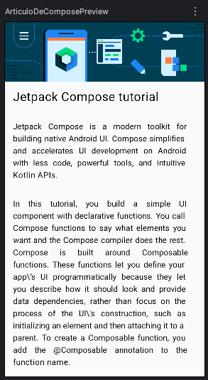

# 📰 Artículo Informativo

Una aplicación Android que muestra una interfaz de artículo informativo siguiendo el ejercicio 5 de la ruta de aprendizaje de Android Studio.

## 📸 Vista previa

<p align="center">
  
</p>

## 🛠️ Tecnologías utilizadas

- **Lenguaje**: Kotlin
- **Interfaz**: Jetpack Compose
- **Herramientas**: Android Studio
- **Gestión de dependencias**: Gradle

## 📋 Requisitos del sistema

- Android Studio Arctic Fox o superior
- SDK Android 7.0 (Nougat) o superior
- Gradle 7.0+

## 🚀 Cómo clonar y ejecutar el proyecto

1. **Clona el repositorio**:
```bash
git clone https://github.com/IvanPV23/dsm-articuloinformativo
cd dsm-articuloinformativo
